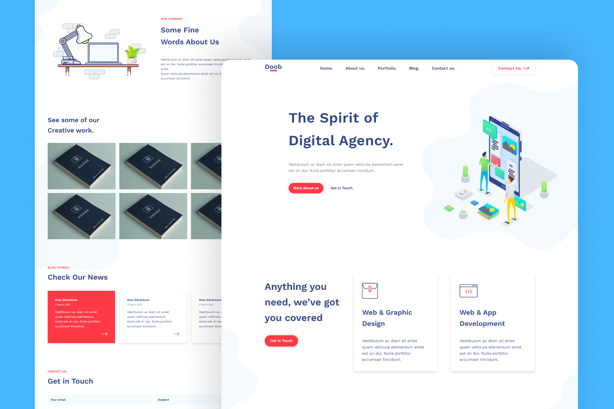

<h1 align='center'>Doob Agency Website</h1>

A digital agency landing page developed using HTML and CSS, built by converting a PSD web template made by [Graphberry](https://www.graphberry.com/item/doob-simple-agency-psd-template) into a usable and responsive website. It comes in a modern and flat design with vibrant colors. This landing page is great for representing a portfolio for a digital agency.

## Preview

## Live Demo
[Click here](https://mohjarabahh.github.io/doob-website) to check out the live demo!

## Technologies
* HTML
* CSS
* [Google Fonts](https://fonts.google.com)
* [GitHub Pages](https://pages.github.com)

## Credits
* PSD Template is from [Graphberry](https://www.graphberry.com)
* SVG Icons are from [Font Awesome](https://fontawesome.com)
* Images are from [Behance](https://www.behance.net)

## License
This project is licensed under the [MIT License](./LICENSE).
